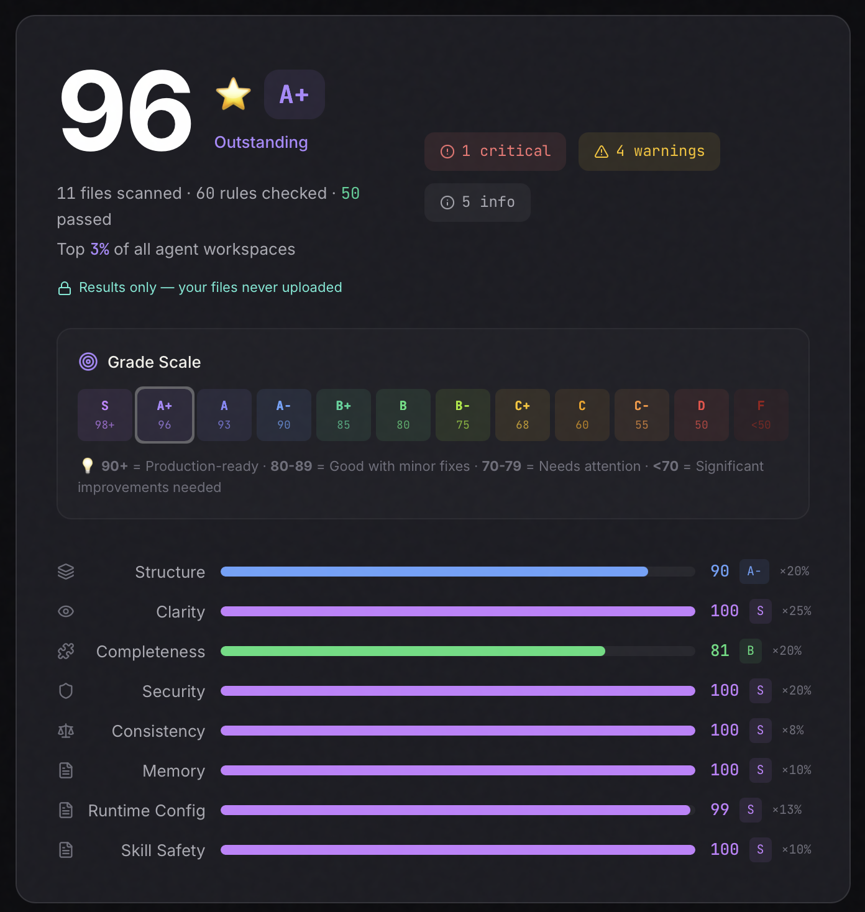

# north-starr

<h3 align="center">Your Development Partner That Reads Your Code, Learns Your Patterns, and Gets Smarter Every Session.</h3>

<p align="center"><em>You don't improve productivity by going faster — you improve it by improving control.</em></p>

<p align="center">
  Install it. Bootstrap your project. Start giving tasks.<br>
  Your AI already knows how to operate.
</p>

<p align="center">
  <a href="https://docs.anthropic.com/en/docs/claude-code">Claude Code</a> &middot;
  <a href="https://code.visualstudio.com/docs/copilot/overview">VS Code Copilot</a> &middot;
  <a href="https://cursor.sh">Cursor</a> &middot;
  Any AI tool
</p>

<p align="center">
  <a href="https://agentlinter.com/r/w7Jo9X0qVOV8"></a><br>
  <a href="https://agentlinter.com/r/w7Jo9X0qVOV8">agentlinter.com/r/w7Jo9X0qVOV8</a>
</p>

---

## The problem

AI coding tools start every project cold. No memory. No awareness of your conventions. No idea where the landmines are. They generate plausible code that breaks your patterns, ignores your architecture, and repeats mistakes you've already solved.

You end up babysitting the AI instead of building.

## What north-starr does

north-starr gives your AI tools **project-specific intelligence** — generated from your actual codebase, not templates.

Run `/bootstrap` once and your AI knows your architecture, your conventions, your danger zones. Work with it. When it learns something new, that knowledge persists. Next session, it's smarter than the last.

**Language-agnostic. Works for any project** — iOS, web, backend, infrastructure, anything.

---

## Three things that matter

### 1. Loyal to your code

north-starr reads your actual codebase. It discovers how *your* project is structured, what patterns *your* team follows, where *your* danger zones are. Nothing is templated or assumed. The configuration it generates reflects reality — your reality.

Every rule, every context file, every agent instruction comes from what's actually in your code.

### 2. Orchestration adapts to complexity

Not every task needs the same level of care. north-starr assesses complexity automatically:

- **Simple tasks** — your AI just works, guided by the rules already in place
- **Medium tasks** — risk analysis runs automatically before implementation
- **Complex tasks** — full orchestration kicks in: risk analysis, structured planning, then execution

You don't configure this. Skills trigger based on what the task needs. The AI knows when to be careful and when to move fast.

### 3. AI learns from its own mistakes

When your AI gets corrected, discovers an undocumented convention, or breaks something — north-starr captures that as a **pattern rule** (how things should be done) or a **landmine rule** (what to watch out for). These rules feed directly into how your AI tools operate.

No parallel knowledge system. No external database. Everything becomes native configuration that your tools load automatically on the next task.

The result: **mistakes happen once, not twice.**

---

## Get started in 60 seconds

### Step 1: Install

**Claude Code plugin (recommended):**
```
/plugin marketplace add selcukyucel/north-starr
/plugin install north-starr
```

**Or Homebrew (works with any AI tool):**
```bash
brew tap selcukyucel/north-starr https://github.com/selcukyucel/north-starr.git
brew install north-starr
cd your-project && north-starr init
```

### Step 2: Bootstrap

```
/bootstrap
```

That's it. north-starr explores your codebase and generates everything your AI needs — architecture context, pattern rules, landmine rules, module-level context files, specialized agents. All in your tool's native format.

For a **new project** with no code yet, use `/architect` instead to declare your intended architecture upfront.

### Step 3: Start working

Give your AI any task. It now understands your project. Rules fire automatically when touching matching files. Context loads when entering specific modules. Complexity is assessed on every task.

As you work, your AI partner gets smarter. That's the whole idea.

---

## How it works

```
  Install  ─────►  /bootstrap  ─────►  Start working
                        │                     │
                        │              AI uses rules &
                        │              context automatically
                        │                     │
                        │               You correct AI
                        │              or discover things
                        │                     │
                        ▼                     ▼
                  Rules, context        /learn captures
                  & agents generated     new patterns &
                  from YOUR code         landmines
                        │                     │
                        └─────── Next session ─┘
                                 AI is smarter
```

### What gets generated

north-starr produces **tool-native configuration** — not its own format, but the exact files each tool already reads:

| What | Purpose |
|------|---------|
| `CLAUDE.md` | Architecture, grain, module map, danger zones — auto-loaded by Claude Code |
| `AGENTS.md` | Universal project context — works with any AI tool |
| `.claude/rules/` `.github/instructions/` `.cursor/rules/` | Conventions scoped by file path — auto-enforced when touching matching files |
| `.claude/agents/` `.github/agents/` | Project-tuned specialized agents |
| Module-level `CLAUDE.md` files | Contextual warnings for specific modules (e.g., `src/payments/CLAUDE.md`) |

### The grain concept

Every codebase has a **grain** — a direction that changes flow easily. Adding a new API endpoint might be straightforward. Adding a new data model might require touching 12 files. north-starr identifies this grain and documents it, so your AI knows which changes are safe and which require extra care.

### Validation loop

For new projects, `/architect` marks everything as `[DECLARED]` — intent, not yet verified. When you later run `/bootstrap`, each declaration is validated against real code:

- **CONFIRMED** — code matches, tag removed, convention is a verified fact
- **DIVERGED** — code differs, you decide which version to keep
- **NOT YET** — no code exists yet, intent preserved

This loop keeps your AI configuration honest as your project evolves.

---

## Skills

| Skill | What it does |
|-------|--------------|
| `/bootstrap` | Generates rules, agents, and context from your existing code |
| `/architect` | Defines architecture and conventions for a new project (before code exists) |
| `/learn` | Captures patterns and landmines from experience — updates configuration |
| `/invert` | Risk analysis before complex tasks — what could go wrong? |
| `/plan` | Persistent implementation plans for multi-session work |
| `/document` | Generates a context file for a specific module |

---

## Update & Uninstall

### Update

**Plugin:**
```
/plugin update north-starr
```

**Homebrew:**
```bash
brew update && brew upgrade north-starr
north-starr update    # updates skills in current project
```

### Uninstall

**Plugin:**
```
/plugin uninstall north-starr
```

**Homebrew:**
```bash
brew uninstall north-starr && brew untap selcukyucel/north-starr
```

### CLI reference

```bash
north-starr init       # Install skills in a project
north-starr update     # Update skills (preserves your config)
north-starr status     # Check setup status
north-starr config     # Set which AI tools to generate config for
north-starr version    # Show version
north-starr help       # Show help
```

### Tool preferences

north-starr only generates artifacts for tools you actually use. Set preferences with `north-starr config` or they're prompted on first `north-starr init`. Stored in `.north-starr.json`:

```json
{
  "version": 1,
  "targets": ["claude"]
}
```

Valid targets: `"claude"`, `"copilot"`, `"cursor"`. `AGENTS.md` is always generated regardless.

---

## Inspiration

north-starr is inspired by the [Idea Flow](https://leanpub.com/ideaflow) methodology by **Janelle Arty Starr** — a framework for making invisible friction visible in software development.

The core insight: *you don't improve productivity by going faster, you improve it by improving control.* north-starr applies this to AI-assisted development — your AI partner learns your patterns, remembers your landmines, and works with control, not just speed.

**Learn more about Idea Flow:**
[The book](https://leanpub.com/ideaflow) &middot; [Talk](https://www.youtube.com/watch?v=qqaOpSJKdWc) &middot; [Podcast](https://legacycoderocks.libsyn.com/idea-flow-with-arty-starr) &middot; [*"The most underrated book in software engineering management"*](https://ericnormand.substack.com/p/the-most-underrated-book-in-software)

---

## Thanks

- [Tolga Ergin](https://github.com/tolgaergin) — for contributions to the v2.0.0 architecture

## Contributing

Contributions are welcome! If you've improved skills, found edge cases, or adapted north-starr for specific workflows, please open a PR.

## License

MIT — see [LICENSE](LICENSE)
