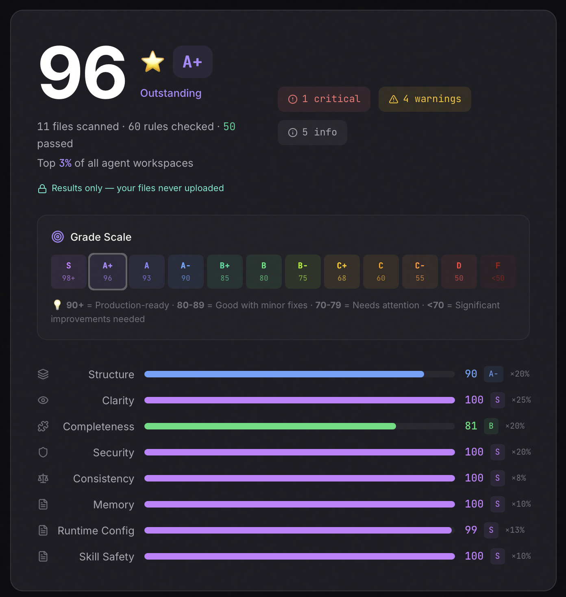

# north-starr

<h3 align="center">Agentic Development Workflow for AI Coding Tools</h3>

<p align="center"><em>You don't improve productivity by going faster — you improve it by improving control.</em></p>

<p align="center">
  <a href="https://docs.anthropic.com/en/docs/claude-code">Claude Code</a> (marketplace) &middot;
  <a href="https://code.visualstudio.com/docs/copilot/overview">VS Code Copilot</a> (Marketplace or Homebrew)
</p>

<p align="center">
  <a href="https://agentlinter.com/r/w7Jo9X0qVOV8"></a><br>
  <a href="https://agentlinter.com/r/w7Jo9X0qVOV8">agentlinter.com/r/w7Jo9X0qVOV8</a>
</p>

---

## Inspiration

north-starr is inspired by [Idea Flow](https://leanpub.com/ideaflow) by **Janelle Arty Starr** — a framework for making invisible friction visible in software development.

The core insight: *you don't improve productivity by going faster, you improve it by improving control.* north-starr applies this to AI-assisted development — your AI partner learns your patterns, remembers your landmines, and works with control, not just speed.

[The book](https://leanpub.com/ideaflow) &middot; [Talk](https://www.youtube.com/watch?v=qqaOpSJKdWc) &middot; [Podcast](https://legacycoderocks.libsyn.com/idea-flow-with-arty-starr) &middot; [*"The most underrated book in software engineering management"*](https://ericnormand.substack.com/p/the-most-underrated-book-in-software)

---

## How it works

Every task goes through a complexity gate. Simple tasks flow fast. Complex tasks get automatic risk analysis and structured planning. The AI decides — you approve.

```
Task given
    │
    ▼
Complexity Assessment
    │
    ├─ Low ──────────► State files → Wait for approval → Code
    │
    ├─ Medium/High ──► /invert (risk analysis)
    │                      │
    │                      ▼
    │                  layoutplan agent (separate thread)
    │                      │
    │                      ▼
    │                  Approval gate → Code
    │
    ▼
RED (failing tests) → GREEN (implementation)
    │
    ▼
Completion menu:
    ├─ /generate-commit
    ├─ /generate-pr
    ├─ /learn (capture patterns & landmines)
    └─ Done
```

### The complexity gate

Before any code change, the AI prints this assessment:

| # | Question | Answer |
|---|----------|--------|
| 0 | Is current behavior covered by tests? | Yes / No |
| 1 | How many files will this change? | 1-2 / 3+ |
| 2 | Am I creating new types or protocols? | No / Yes |
| 3 | Does this require cross-module integration? | No / Yes |

- **All low** → state the files and proceed
- **Q0 = No** → write tests for current behavior first
- **Any medium/high** → run `/invert` automatically, then plan before coding

No configuration needed. This is built into every project north-starr bootstraps.

### PRD decomposition

For full product specs, `/decompose` breaks the work into manageable pieces before the complexity gate kicks in:

```
PRD received
    │
    ▼
/decompose → Scan & detect AI project
    │
    ├─ Non-AI project ──► storymap agent → .plans/STORIES-<name>.md
    │
    ├─ AI project ──────► chief-ai-po agent → .plans/STORIES-AI-<name>.md
    │                      (inverted stories, safety stories SA.1-SA.6,
    │                       human oversight checkpoints, graceful degradation)
    │
    ▼
Optional: GitHub Issues script
    │
    ▼
Pick a story → /invert → layoutplan → Implement
```

---

## Install

**Claude Code** (marketplace):
```
/plugin marketplace add selcukyucel/north-starr
/plugin install north-starr
```

**VS Code Copilot** (Marketplace):
```
ext install selcukyucel.north-starr
```
Or: Extensions panel → search "north-starr" → Install.

**VS Code Copilot** (Homebrew — CLI + skills in the project):
```bash
brew tap selcukyucel/north-starr https://github.com/selcukyucel/north-starr.git
brew install north-starr
cd your-project && north-starr init
```

Then run `/bootstrap` — north-starr explores your codebase and generates everything your AI needs.

---

## What `/bootstrap` generates

All output is **tool-native** — the exact files each tool already reads:

| Artifact | Claude Code | VS Code Copilot |
|----------|-------------|-----------------|
| Project context | `CLAUDE.md` | `AGENTS.md` |
| Universal context | `AGENTS.md` | `AGENTS.md` |
| Pattern rules | `.claude/rules/*.md` | `.github/instructions/*.instructions.md` |
| Landmine rules | `.claude/rules/*.md` | `.github/instructions/*.instructions.md` |
| Agents | `.claude/agents/layoutplan.md`, `storymap.md`, `chief-ai-po.md` | `.github/agents/layoutplan.agent.md`, `storymap.agent.md`, `chief-ai-po.agent.md` |
| Module context | `CLAUDE.md` per module | — |

Pattern rules document **how things are done** in your codebase. Landmine rules document **what to watch out for**. Both are scoped by file path — they fire only when the AI touches matching files.

---

## The learning loop

When your AI gets corrected, discovers a convention, or breaks something — `/learn` captures it as a pattern or landmine rule. These rules feed directly into how the AI operates next session.

```
You correct AI → /learn captures it → Rule created → AI follows it next time
```

Mistakes happen once, not twice.

---

## Skills & Agents

### Workflow skills (triggered automatically by the complexity gate)

| Skill | What it does |
|-------|--------------|
| `/invert` | Risk analysis — identifies failure modes, AI-specific risks, data flow issues, assumptions, and domain consequences before implementation |
| `/decompose` | Decomposes a PRD into prioritized, dependency-mapped epics and user stories. Detects AI projects, filters non-dev content, respects hard deadlines. Optionally creates GitHub Issues. |
| `/learn` | Captures patterns and landmines from experience into native rules. Validates globs, cross-references, and line limits. |

| Agent | What it does |
|-------|--------------|
| `layoutplan` | Builds multi-session implementation plans from `/invert` analysis. Runs on a separate thread. |
| `storymap` | Decomposes PRDs into epics and user stories with dependencies and priorities. Spawned by `/decompose`. |
| `chief-ai-po` | AI Product Owner — decomposes AI project PRDs with inverted failure modes, 6 mandatory safety stories (SA.1-SA.6), human oversight checkpoints, graceful degradation criteria, and AI cost signals. Spawned by `/decompose` for AI projects. |

### Project setup

| Skill | What it does |
|-------|--------------|
| `/bootstrap` | Generates rules, agents, and context from your existing codebase. Includes quality gate, virtues integration, and stack detection for any language. |
| `/sync` | Updates managed sections after a plugin update. Supports dry-run preview, version tracking, and post-sync validation. |

### Productivity

| Skill | What it does |
|-------|--------------|
| `/generate-commit` | Analyzes staged changes and generates commit messages. Detects conventional commits, suggests splitting multi-concern changes, flags breaking changes. |
| `/generate-pr` | Generates PR descriptions from git diffs. Detects project PR templates, flags breaking changes, assesses risk, suggests reviewers. |
| `/analyze-code` | Finds refactoring opportunities, code smells, and architecture violations |
| `/report-weekly` | Generates weekly commit reports as markdown and styled HTML. Supports custom date ranges, PR activity via gh CLI, and trend comparison. |

---

## The 7 Code Virtues

All patterns, landmines, and refactoring analysis are guided by the Code Virtues — prioritized top to bottom. Higher virtues win when they conflict.

| # | Virtue | Opposite | Meaning |
|---|--------|----------|---------|
| 1 | **Working** | incomplete | Functions correctly; tests prove it |
| 2 | **Unique** | duplicated | One source of truth; no copy-paste |
| 3 | **Simple** | complex | Fewer entities, operations, relationships |
| 4 | **Clear** | puzzling | Intent obvious to reader |
| 5 | **Easy** | difficult | Adding/modifying code is not arduous |
| 6 | **Developed** | primitive | Mature abstractions, well-designed types |
| 7 | **Brief** | chatty | Concise without sacrificing higher virtues |

---

## The grain concept

Every codebase has a **grain** — a direction that changes flow easily. Adding a new API endpoint might be straightforward. Adding a new data model might require touching 12 files. north-starr identifies this grain so your AI knows which changes are safe and which require extra care.

---

## Update & Uninstall

**Claude Code:**
```
/plugin update north-starr        # update
/plugin uninstall north-starr     # uninstall
```

**Homebrew:**
```bash
brew upgrade north-starr          # update CLI
north-starr update                # update skills in current project
brew uninstall north-starr        # uninstall
```

### CLI reference (Homebrew only)

```bash
north-starr init       # Install skills in a project
north-starr update     # Update skills (preserves your config)
north-starr status     # Check setup status
north-starr version    # Show version
```

---

## Thanks

- [Tolga Ergin](https://github.com/tolgaergin) — for contributions to the v2.0.0 architecture

## Contributing

Contributions welcome. If you've improved skills, found edge cases, or adapted north-starr for specific workflows, open a PR.

## License

MIT — see [LICENSE](LICENSE)
